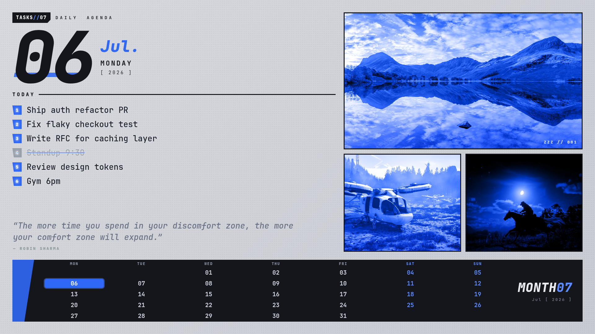

# daily-agenda-wallpaper

A self-updating desktop wallpaper that renders **today's tasks, a live quote, and a
month calendar** as a designed poster — regenerated at login and every 30 minutes.



> Personal desktop tool for **Arch Linux + Hyprland**. Not a cross-platform app — it
> hooks directly into a Wayland wallpaper daemon. Shared as a portfolio/reference piece;
> the interesting parts (the render pipeline and the quote system) are portable ideas.

## What it does

- Reads a plain `today-tasks.txt` you edit each morning and lays the tasks out as a
  numbered agenda, with `x `-prefixed lines struck through.
- Draws a full month calendar with today highlighted.
- Shows one rotating quote — 50/50 **dev** or **stoic** — that changes on every run.
- Fills the art panels with a random wallpaper each run.
- Renders it all to a 1920×1080 PNG and sets it on the laptop panel, leaving any
  external monitor free to keep cycling.

## How it works

The poster is **just a web page**. The generator builds an HTML document (inline
CSS, a `<script>` that draws the calendar), then renders it to a PNG with headless
Chrome:

```bash
google-chrome-stable --headless=new --hide-scrollbars \
  --window-size=1920,1080 --force-device-scale-factor=1 \
  --virtual-time-budget=4000 \
  --screenshot=out.png "file://poster.html"
```

Going through HTML/CSS instead of an image-drawing library means real layout — grid,
flexbox, web fonts, clip-paths — for a fraction of the effort. `--virtual-time-budget`
waits for images to load so cold-boot renders aren't blank.

### The quote system

Each run picks dev or stoic:

- **dev** → a random line from `quotes-dev.txt`.
- **stoic** → fetched live from a public API, run through a **quality gate**, then
  **cached locally** so the pool grows over time. If the fetch fails, is empty, or
  looks like scraped-tweet junk, it falls back to the accumulated cache, then to the
  bundled `quotes-stoic.txt`. Fully functional offline.

The quality gate that keeps `@handle` fragments and truncated tweets out of the cache:

```bash
QTEXT_PART="${QLINE%%|*}"
if [[ -n "$QLINE" && "$QLINE" != *"null"* && "$QLINE" == *"|"* && "$QLINE" != *"@"* \
      && ${#QLINE} -le 160 && ${#QTEXT_PART} -ge 25 && "$QTEXT_PART" =~ ^[A-Z] ]]; then
  # accept + cache
fi
```

## Install (Arch / Hyprland)

Requires: `hyprland`, a wallpaper daemon (`awww`/`swww`), `google-chrome-stable`,
`jq`, `curl`, and JetBrainsMono Nerd Font.

```bash
git clone https://github.com/mrwick1/daily-agenda-wallpaper.git
cd daily-agenda-wallpaper
cp today-tasks.example.txt ~/today-tasks.txt      # your daily task list
ln -sf "$PWD/task-wallpaper" ~/.local/bin/task-wallpaper
task-wallpaper                                     # render + set once
```

To run it at login and refresh every 30 minutes, add to `hyprland.conf`:

```
exec-once = bash -c 'while :; do ~/.local/bin/task-wallpaper >/dev/null 2>&1; sleep 1800; done'
```

## Config

| File / env | Purpose |
|---|---|
| `~/today-tasks.txt` | Task list. One per line; `#` comments and blanks ignored; `x ` = done; first 8 shown. |
| `quotes-dev.txt` / `quotes-stoic.txt` | Quote pools, `text\|author` per line. Extend freely. |
| `TASKS_FILE` | Override the task file path. |
| `TASK_MONITOR` | Target output (default `eDP-1`). |
| `TASK_WALL_DIR` | Art source directory (default `~/Pictures/wallpapers/anime`). |

## License

MIT © Arjun KR
